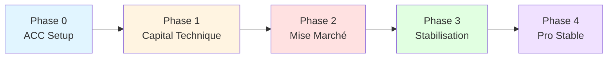

# 🗺️ Roadmap — L1 Strategy

> Feuille de route stratégique dérivée des [[Goals]].
> Les phases décrivent des états atteints, pas des listes de tâches.

---

## Vue d'ensemble

| Phase   | Horizon    | Goals  |
| ------- | ---------- | ------ |
| Phase 0 | Q1 2026    | G1, G5 |
| Phase 1 | Q1-Q2 2026 | G4, G5 |
| Phase 2 | Mai 2026   | G2     |
| Phase 3 | Q2-Q4 2026 | G3, G4 |
| Phase 4 | 2027       | G1     |

---

## Phase 0 — Agentic Command Center (début 2026)
**Goals couverts** : [[Goals#^g1|G1]], [[Goals#^g5|G5]]

### Intention
Rendre le Command Center opérable comme système de pilotage central pour les décisions et le développement de mes systèmes et de ma carrière.

### État attendu
- Couches L0–L1 verrouillées
- Gouvernance agentique en place
- Structure complète du système (L2–L6) prête à être exploitée

---

## Phase 1 — Capital technique initial
**Goals couverts** : [[Goals#^g4|G4]], [[Goals#^g5|G5]]

### Intention
Transformer l’existant en valeur technique démontrable.
Transformer des systèmes existants en actifs techniques autonomes, documentés et commercialisables.
### État attendu
- Audit des systèmes exploitables
- Sélection de systèmes à forte valeur de réutilisation
- Début de découplage, developpement, et de documentation à fins commerciales.

---

## Phase 2 — Mise sur marché et validation
**Goals couverts** : [[Goals#^g2|G2]]

### Intention
Vérifier la viabilité économique du positionnement.

### État attendu
- Livrables monétisés publiés
- Premiers retours utilisateurs
- Analyse adéquation et correction adéquat au marché.

---

## Phase 3 — Stabilisation indépendante
**Goals couverts** : [[Goals#^g3|G3]], [[Goals#^g4|G4]]

### Intention
Rendre l’activité crédible et répétable.
Augmenter la cadence et la valeur unitaire des livraisons.

### État attendu
- Augmentation des revenus réguliers
- Augmentation de la valeur du portfolio public et structuration
- Processus de livraison stabilisé

---

## Phase 4 — Projection professionnelle
**Goals couverts** : [[Goals#^g1|G1]]

### Intention
Sécuriser une situation professionnelle durable.

### État attendu
- Contrat ou revenus stables
- Positionnement professionnel clair
- Méthodologie transmissible

---

## Règles de gouvernance
- La roadmap est **non exhaustive**
- Les phases ne se chevauchent pas sans décision
- Toute évolution majeure nécessite une ADR

---

*🔐 Document append-only.*

*↑ [[_Index|Stratégie]]*
