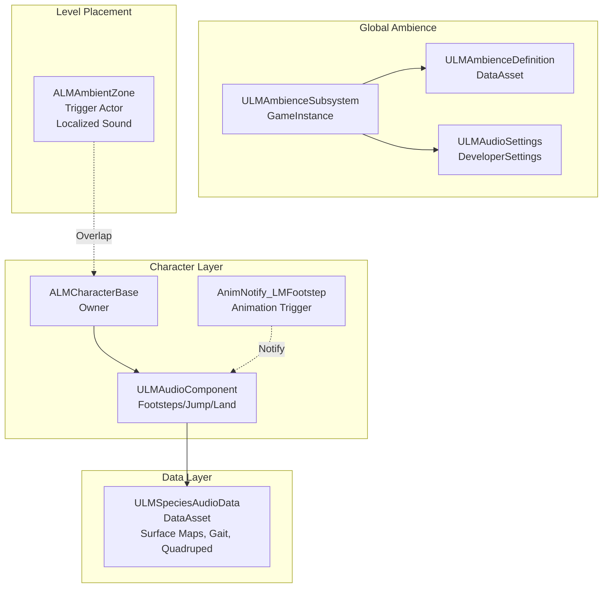

# L2 Design — Audio/Ambience System Extraction

**System**: Surface-Aware Audio & Ambient Environment  
**Source**: Apex Primal (LinkMeProject)  
**Target**: Fab/Marketplace Asset  
**Status**: DRAFT  
**Created**: 2026-01-22  
**Links**: [G2 (Premiers Actifs)](file:///c:/Obsidian%20Vaults/UE%20Projects/L1_Strategy/Goals.md#L37)

---

## Executive Summary

Extract a **production-ready audio system** from Apex Primal comprising:
1. **Species Audio Component** — Surface-aware footstep system with gait modulation, quadruped paw delay
2. **Ambience Subsystem** — MetaSound-driven global ambience with parameter control
3. **Ambient Zones** — Trigger-based localized ambient sounds

**Market Positioning**: "Pro Surface-Aware Audio System - UE5 MetaSound Ready"

**Key Differentiators**:
- Data-driven via DataAssets (no hard-coding)
- Physical Surface mapping (automatic material detection)
- Gait-aware volume (Walk/Jog/Sprint)
- Quadruped support (paw delay system)
- MetaSound integration for procedural ambience
- Network-ready architecture

---

## System Components

### 1. Core Components (C++)

#### 1.1 ULMAudioComponent
**File**: `LMAudioComponent.h/.cpp` (105 LOC)  
**Type**: ActorComponent  
**Responsibility**: Character audio playback (footsteps, jump, land)

**Key Features**:
- Surface detection via line trace → `EPhysicalSurface`
- TMap lookup: `PhysicalSurface` → `USoundBase*`
- Gait volume modulation (Walk 0.5x, Jog 0.75x, Sprint 1.0x)
- Quadruped paw delay (configurable per species)
- Pitch/Volume randomization
- DSP Source Effect Chain support

**Public API**:
```cpp
void PlayFootstep(FName SocketName, float GaitVolumeMultiplier);
void PlayJump();
void PlayLand(float ImpactIntensity);
void UpdateFootstepLogic(float DeltaTime, float Speed, float StrideLength);
```

**Dependencies**:
- Character owner (for sockets, trace origin)
- `ULMSpeciesAudioData` (DataAsset)

---

#### 1.2 ULMAmbienceSubsystem
**File**: `LMAmbienceSubsystem.h/.cpp` (65 LOC)  
**Type**: `UGameInstanceSubsystem`  
**Responsibility**: Global ambience management

**Key Features**:
- Spawns 2D AudioComponents for global sounds
- MetaSound parameter control (`WindIntensity`, `RainIntensity`)
- DataAsset-driven configuration (`ULMAmbienceDefinition`)
- Automatic fade-in/out on ambience change

**Public API**:
```cpp
void SetAmbience(ULMAmbienceDefinition* NewAmbience);
void StopAmbience();
void SetGlobalWindIntensity(float NewIntensity);
void SetGlobalRainIntensity(float NewIntensity);
```

**Dependencies**:
- `ULMAudioSettings` (Project Settings)
- `ULMAmbienceDefinition` (DataAsset)

---

#### 1.3 ALMAmbientZone
**File**: `LMAmbientZone.h/.cpp` (62 LOC)  
**Type**: Actor  
**Responsibility**: Localized ambient sound trigger

**Key Features**:
- BoxComponent trigger volume
- AudioComponent for looping sound
- Fade-in/out on enter/exit
- Overlap counter (multi-player safe)

**Config**:
```cpp
USoundBase* AmbientSound;
float FadeInTime = 1.0f;
float FadeOutTime = 1.0f;
float VolumeMultiplier = 1.0f;
```

---

#### 1.4 AnimNotify_LMFootstep
**File**: `AnimNotify_LMFootstep.h/.cpp` (37 LOC)  
**Type**: UAnimNotify  
**Responsibility**: Animation-driven footstep trigger

**Key Features**:
- Calls `ULMAudioComponent::PlayFootstep()` from AnimBP
- Configurable socket name (foot_l, foot_r, etc.)
- Volume multiplier override

---

### 2. Data Assets

#### 2.1 ULMSpeciesAudioData
**File**: `LMSpeciesAudioData.h/.cpp` (157 LOC)  
**Type**: DataAsset  
**Responsibility**: Per-species audio configuration

**Data Structure**:
```cpp
// Footsteps
TMap<EPhysicalSurface, USoundBase*> FootstepSounds;
USoundBase* DefaultFootstepSound;
USoundBase* HeavyFootstepLayer;  // Secondary bass layer

// Actions
USoundBase* JumpSound;
USoundBase* LandSoundLight;
USoundBase* LandSoundHeavy;
float HeavyLandingThreshold = 0.5f;

// Settings
float BasePitchModifier = 1.0f;       // Species-specific pitch
float BaseVolumeModifier = 1.0f;      // Species-specific volume
float FootstepPhaseBias = 0.0f;       // Sync adjustment
USoundEffectSourcePresetChain* SourceEffectChain;  // DSP
USoundEffectSourcePresetChain* HeavySourceEffectChain;

// Quadruped
float QuadrupedPawDelay = 0.08f;
bool bQuadrupedRearPawFirst = false;

// Gait Volume
float WalkVolumeMultiplier = 0.5f;
float JogVolumeMultiplier = 0.75f;
float SprintVolumeMultiplier = 1.0f;
```

---

#### 2.2 ULMAmbienceDefinition
**File**: `LMAmbienceDefinition.h` (28 LOC)  
**Type**: DataAsset  
**Responsibility**: Ambience preset configuration

**Data Structure**:
```cpp
USoundBase* AmbienceMetaSound;       // Main MetaSound (Wind + Bed + OneShots)
float DefaultWindIntensity = 0.2f;
```

---

#### 2.3 ULMAudioSettings
**File**: `LMAudioSettings.h/.cpp` (36 LOC)  
**Type**: `UDeveloperSettings`  
**Responsibility**: Project-wide audio configuration

**Data Structure**:
```cpp
TSoftObjectPtr<USoundBase> GlobalWindMetaSound;
TSoftObjectPtr<USoundBase> JungleBedMetaSound;
float DefaultWindIntensity = 0.2f;
```

**Access**: Project Settings → Game → LinkMe Audio

---

## Architecture Diagram



---

## Data Flow

### Footstep Playback Flow

1. **Animation Event**: AnimNotify_LMFootstep fires in AnimBP
2. **Component Call**: Notify calls `ULMAudioComponent::PlayFootstep(SocketName, GaitMultiplier)`
3. **Surface Detection**: Component line-traces from socket → `EPhysicalSurface`
4. **Sound Lookup**: `LMSpeciesAudioData->FootstepSounds.Find(Surface)` → `USoundBase*`
5. **Modulation**:
   - Volume: `BaseVolume * GaitMultiplier * RandomRange * SpeciesModifier`
   - Pitch: `BasePitch * RandomRange * SpeciesModifier`
6. **Quadruped Logic** (if applicable):
   - First paw plays immediately
   - Second paw scheduled after `QuadrupedPawDelay`
7. **Playback**: `UGameplayStatics::SpawnSoundAttached()` with DSP chain

### Ambience Flow

1. **Level Blueprint**: Calls `AmbienceSubsystem->SetAmbience(JungleDayAmbience)`
2. **Subsystem**: Stops previous AudioComponents
3. **Subsystem**: Spawns new 2D AudioComponents from `AmbienceDefinition->AmbienceMetaSound`
4. **Parameter Control**: `AudioComponent->SetFloatParameter("WindIntensity", 0.2)`
5. **Dynamic Updates**: Game code calls `SetGlobalWindIntensity(0.8)` → MetaSound updates in realtime

---

## Extraction Strategy

### 1. Module Structure

**Target Module**: `AudioSystem` (standalone plugin)

```
AudioSystem/
├── Source/
│   ├── AudioSystem/
│   │   ├── Public/
│   │   │   ├── Components/
│   │   │   │   └── LMAudioComponent.h
│   │   │   ├── Actors/
│   │   │   │   └── LMAmbientZone.h
│   │   │   ├── Subsystems/
│   │   │   │   └── LMAmbienceSubsystem.h
│   │   │   ├── Data/
│   │   │   │   ├── LMSpeciesAudioData.h
│   │   │   │   ├── LMAmbienceDefinition.h
│   │   │   │   └── LMAudioSettings.h
│   │   │   └── Animation/
│   │   │       └── AnimNotify_LMFootstep.h
│   │   └── Private/
│   │       └── (matching .cpp files)
│   └── AudioSystem.Build.cs
└── Content/
    ├── Demo/
    │   ├── Maps/
    │   │   └── DM_AudioSystem_Showcase.umap
    │   ├── Audio/
    │   │   ├── Footsteps/
    │   │   │   ├── SFX_Footstep_Grass.uasset
    │   │   │   ├── SFX_Footstep_Stone.uasset
    │   │   │   └── ...
    │   │   └── Ambience/
    │   │       ├── MS_JungleDay.uasset (MetaSound)
    │   │       └── MS_Wind_Global.uasset
    │   └── Data/
    │       ├── DA_SpeciesAudio_Example.uasset
    │       └── DA_Ambience_JungleDay.uasset
    └── Documentation/
        └── README.md
```

---

### 2. Dependencies to Remove/Abstract

#### Current Dependencies (Apex-specific):
- `ALMCharacterBase` → **Abstract to `ACharacter` base class**
- `ULMSpeciesData` → **Split**: Extract audio data only
- GAS components → **Remove** (not audio-related)

#### Abstraction Strategy:

**Option A (Minimal Coupling)**:
- `ULMAudioComponent` requires only:
  - `AActor* Owner` (for GetWorld, sockets)
  - `USkeletalMeshComponent*` (for socket locations)
  - `ULMSpeciesAudioData*` (provided via getter or property)

**Recommended Interface**:
```cpp
// Simple interface for audio-enabled characters
class AUDIOSYSTEM_API ILMAudioInterface {
public:
    virtual ULMSpeciesAudioData* GetAudioData() const = 0;
};

// Component checks for interface
if (ILMAudioInterface* AudioInterface = Cast<ILMAudioInterface>(GetOwner())) {
    CachedAudioData = AudioInterface->GetAudioData();
}
```

**Option B (Standalone Component)**:
- Remove `ALMCharacterBase` dependency entirely
- Add `UPROPERTY(EditAnywhere)` direct reference to `SpeciesAudioData`
- User assigns DataAsset manually in editor

**Chosen**: **Option B** (simpler for marketplace, no interface needed)

---

### 3. Code Changes Required

#### LMAudioComponent.h
```diff
- class ALMCharacterBase;
+ // No character dependency

// Remove:
- UPROPERTY(Transient)
- TObjectPtr<ALMCharacterBase> OwnerCharacter;

// Add:
+ /** Species Audio Data (assign manually or via Blueprint) */
+ UPROPERTY(EditAnywhere, BlueprintReadWrite, Category = "Audio")
+ TObjectPtr<ULMSpeciesAudioData> SpeciesAudioData;

// Change BeginPlay logic:
- OwnerCharacter = Cast<ALMCharacterBase>(GetOwner());
- CachedAudioData = OwnerCharacter->GetSpeciesData()->GetAudioData();
+ CachedAudioData = SpeciesAudioData;
```

#### AnimNotify_LMFootstep.cpp
```diff
// Change lookup:
- ALMCharacterBase* Character = Cast<ALMCharacterBase>(MeshComp->GetOwner());
+ AActor* Owner = MeshComp->GetOwner();
+ ULMAudioComponent* AudioComp = Owner->FindComponentByClass<ULMAudioComponent>();
```

---

### 4. Asset Dependencies

**Required UE5 Features**:
- MetaSound (UE 5.0+)
- Enhanced Input (optional, for demo)
- Physical Materials (base engine)

**Content to Include**:
- Example footstep sounds (Grass, Stone, Wood, Water, Metal)
- Example MetaSound (Wind + Jungle Bed with parameters)
- Demo map with:
  - Physical Material zones
  - Ambient Zones
  - Example character with AudioComponent

---

## Testing & Validation

### Unit Tests (C++)
1. Surface detection returns correct `EPhysicalSurface`
2. Sound lookup fallback to `DefaultFootstepSound`
3. Gait volume interpolation (0 → 0.5 → 1.0)
4. Quadruped paw delay timing (0.08s ± 0.01s)
5. MetaSound parameter propagation

### Integration Tests (Editor)
1. Place character on different surfaces → correct sounds play
2. Change gait speed → volume modulates
3. Quadruped: Two sounds play with delay
4. AmbienceSubsystem setters → MetaSound updates
5. AmbientZone overlap → fade in/out

### Performance Benchmarks
- Footstep cost: < 0.1ms per call
- Ambience subsystem: < 0.5ms/frame
- Memory: ~500KB per species DataAsset

---

## Documentation Plan

### README.md Structure
1. **Quick Start** (5 min integration)
2. **Component Setup** (add to Character)
3. **DataAsset Creation** (Species Audio Data)
4. **Surface Configuration** (Physical Materials)
5. **Ambience Setup** (Subsystem + Zones)
6. **MetaSound Integration**
7. **Blueprint Examples**
8. **Troubleshooting** (common issues)

### Video Demo
- 0:00 - System overview
- 0:30 - Surface-aware footsteps
- 1:00 - Gait modulation
- 1:30 - Quadruped paw delay
- 2:00 - Ambience system
- 2:30 - MetaSound control
- 3:00 - Integration steps

---

## Risks & Mitigation

| Risk                                   | Impact | Probability | Mitigation                              |
| -------------------------------------- | ------ | ----------- | --------------------------------------- |
| **Tight coupling to LMCharacterBase**  | High   | Low         | Option B (direct DataAsset reference)   |
| **MetaSound version compatibility**    | Medium | Medium      | Document min UE version (5.1+)          |
| **Physical Material setup complexity** | Medium | High        | Provide template PhysMat assets         |
| **Quadruped logic too niche**          | Low    | Medium      | Make optional (works for biped too)     |
| **Audio content copyright**            | High   | Low         | Use royalty-free or original recordings |

---

## Market Validation

**Comparable Assets** (Fab/Marketplace):
- "Footstep Sound System" - $49.99 ⭐⭐⭐⭐ (lacks surface detection)
- "Advanced Locomotion Audio" - $79.99 ⭐⭐⭐⭐⭐ (no MetaSound)
- "Dynamic Ambience System" - $39.99 ⭐⭐⭐ (basic only)

**Our Advantages**:
1. ✅ Physical Surface auto-detection
2. ✅ MetaSound integration (cutting-edge)
3. ✅ Data-driven (no code changes)
4. ✅ Quadruped support (unique)
5. ✅ Network-ready architecture

**Pricing Recommendation**: **$59.99** (mid-tier, justified by features)

---

## Implementation Scope

### Phase 1 — Core Extraction (Sprint 1)
- [ ] Copy files to new plugin structure
- [ ] Remove Apex-specific dependencies
- [ ] Refactor `LMAudioComponent` (Option B)
- [ ] Update AnimNotify to generic Character
- [ ] Compile + fix errors

### Phase 2 — Content Creation (Sprint 2)
- [ ] Record/source footstep sounds (6 surfaces)
- [ ] Create example MetaSound
- [ ] Build demo map with surface zones
- [ ] Create 2 example Species DataAssets

### Phase 3 — Polish & Documentation (Sprint 3)
- [ ] Write README.md
- [ ] Record demo video
- [ ] Create Blueprint examples
- [ ] Performance profiling
- [ ] Code comments cleanup

### Phase 4 — Submission (Sprint 4)
- [ ] Fab submission guidelines review
- [ ] Package plugin
- [ ] Marketplace listing (description, images)
- [ ] Submit for review

**Total Estimated Effort**: 3-4 weeks (full-time)

---

## Success Criteria

✅ **Technical**:
- Compiles without errors UE 5.5+
- Zero hard-coded dependencies
- < 1ms footstep playback cost
- Works on Listen Server + Dedicated Server

✅ **Content**:
- 6+ physical surfaces demoed
- 1 complete MetaSound ambience
- Professional demo map
- 10-page documentation

✅ **Market**:
- Fab submission accepted
- 4+ star rating target
- Positive feedback on MetaSound integration

---

## Status

- **Design State**: DRAFT
- **Ready for Planning**: YES (after human validation)
- **Requires ADR**: NO (extraction, not architectural change)
- **Risks Identified**: See table above

---

## Next Steps

1. **Human Validation** of this architecture
2. **DEV.Planner** → Create L3 implementation plan
3. **Execute** extraction (manual or with DEV.Coder)
4. **Verify** in clean UE project

---

*Design by: DEV.Architect*  
*Validation required before proceeding to L3 Planning*
